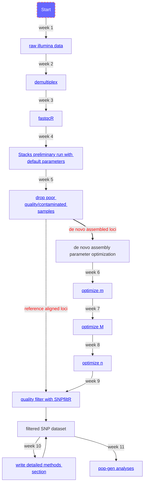

# Fall.2022.RAD.workshop

This repository will hold code and general information for how to analyze a RADseq dataset on the KU high performance computing cluster. Each week we will meet and work together to progress through the pipeline, starting the semester with raw sequence data and hopefully ending with population genetic analyses and exciting new knowledge about the evolutionary history of some of our favorite organisms. Even if you're not part of the working group that meets each week, you should be able to follow the flowchart below, clicking on each box for detailed instructions on each step in the process.

## Flowchart for working through a RAD dataset

## Detailed semester schedule
> You can access the detailed information you will need to follow along with your own dataset each week by clicking on the header for the given week.

### [Week 1](https://github.com/DevonDeRaad/Fall.2022.RAD.workshop/tree/main/week1):
> Introduction to the command-line, plus instructions on moving your raw sequence data onto the KU cluster.

### [Week 2](https://github.com/DevonDeRaad/Fall.2022.RAD.workshop/tree/main/week2):
> Demultiplexing our raw sequence data into a separate .fastq.gz file for each individual sample, and submitting our first jobs to the KUHPCC slurm manager.

### [Week 3](https://github.com/DevonDeRaad/Fall.2022.RAD.workshop/tree/main/week3):
> Sample quality control (QC) using the R package [fastqcR](https://github.com/kassambara/fastqcr). We will assess the quality and amount of sequence data in each sample and immediately remove samples that have very low numbers of raw reads, i.e., [bad apples](https://besjournals.onlinelibrary.wiley.com/doi/full/10.1111/2041-210X.13562).

### [Week 4](https://github.com/DevonDeRaad/Fall.2022.RAD.workshop/tree/main/week4):
> We will run through the entire [Stacks](https://catchenlab.life.illinois.edu/stacks/) pipeline with default parameters to generate a preliminary SNP dataset.

### [Week 5](https://github.com/DevonDeRaad/Fall.2022.RAD.workshop/tree/main/week5):
> Perform preliminary pop-gen analyses like making a phylogenetic network and a PCA, to make sure that you don't have issues with duplicate samples, contamination, bar-coding, etc.

### [Week 6](https://github.com/DevonDeRaad/Fall.2022.RAD.workshop/tree/main/week6):
> Now that you have a set of samples you are relatively confident in based on your sample QC and preliminary analyses, we are going to optimize the denovo [Stacks](https://catchenlab.life.illinois.edu/stacks/) assembly parameters based on the 'R80' cutoff suggested in the paper [Lost in Parameter Space](https://besjournals.onlinelibrary.wiley.com/doi/10.1111/2041-210X.12775). We will use the R package [RADStackshelpR](https://github.com/DevonDeRaad/RADstackshelpR) to set up the optimization protocol.

### [Week 7](https://github.com/DevonDeRaad/Fall.2022.RAD.workshop/tree/main/week7):
> We will follow up on our 6 initial [Stacks](https://catchenlab.life.illinois.edu/stacks/) runs using [RADStackshelpR](https://github.com/DevonDeRaad/RADstackshelpR) to determine the optimal value for 'm' (Minimum number of raw reads required to form a stack, i.e., a putative allele). We will then set up 8 additional runs to optimize 'M', specifying the optimal 'm' value for the dataset.

### [Week 8](https://github.com/DevonDeRaad/Fall.2022.RAD.workshop/tree/main/week8):
> We will follow up on our 8 [Stacks](https://catchenlab.life.illinois.edu/stacks/) runs from last week by using [RADStackshelpR](https://github.com/DevonDeRaad/RADstackshelpR) to determine the optimal value for 'M' (Number of mismatches allowed between stacks, i.e., putative alleles, to merge them into a putative locus). We will then set up 3 additional runs to optimize 'n', specifying the optimal 'm' and 'M' values for the dataset.

### [Week 9](https://github.com/DevonDeRaad/Fall.2022.RAD.workshop/tree/main/week9):
> We will assess our final 3 [Stacks](https://catchenlab.life.illinois.edu/stacks/) runs to optimize denovo assembly, determining the optimal 'n' value (Number of mismatches allowed between stacks, i.e., putative loci, during construction of the catalog). We now have an optimized dataset for downstream analyses, which we will filter based on a variety of quality metrics (see [These aren't the loci you're looking for](https://onlinelibrary.wiley.com/doi/full/10.1111/mec.14792)) using the R package [SNPfiltR](https://github.com/DevonDeRaad/SNPfiltR).

### [Week 10](https://github.com/DevonDeRaad/Fall.2022.RAD.workshop/tree/main/week10):
> We will work together on writing a methods section that details exactly what we've done so far to generate an optimized, filtered SNP dataset, so that everything is documented before we have a chance to forget the details of what we've done.

### [Week 11](https://github.com/DevonDeRaad/Fall.2022.RAD.workshop/tree/main/week11):
> Tutorials on pop-gen and phylogenetic analyses that can give insight into the interesting/surprising aspects of your dataset, and help you create publication quality figures.

### Week 12:
> Everyone will give a 10 minute presentation detailing the progress they have made on their system, including details like optimal assembly parameters, optimal filtering parameters, and what evolutionary details you find most interesting and will highlight in your eventual publication.
