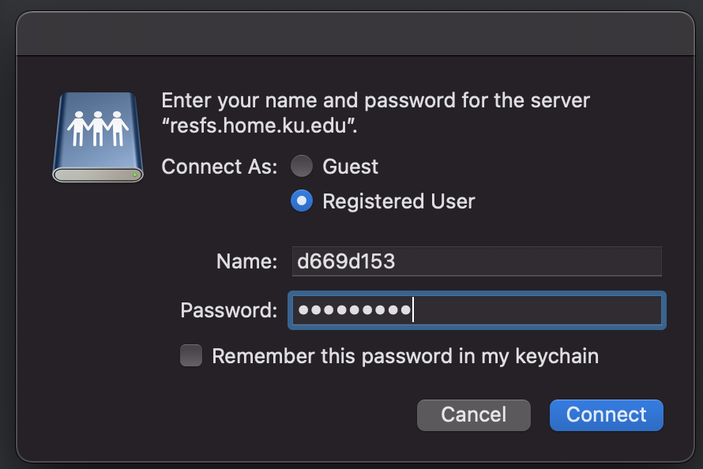

# Moving files from RFS to cluster

KU [Research File Storage](https://technology.ku.edu/catalog/research-file-storage) (RFS) is a permament place to store sequence data. Often, we will want to move sequence data from this permanent storage location to the [KU high performance computing cluster](https://crc.ku.edu/hpc) (KUHPCC). The KUHPCC has great resources and tutorials for getting started working on the cluster available on the 'how-to' [tab](https://crc.ku.edu/hpc/how-to) of thier website. If you are just getting started working on the cluster, I highly recommend perusing this webpage.

### note
If you are trying to connect to RFS from an off-campus internet connection, you must first use the Cisco AnyConnect VPN to access kuanywhere.ku.edu, a full tutorial for setting this up is available [here](https://kuit.service-now.com/kb?id=kb_article_view&sysparm_article=KB0010646&sys_kb_id=46742529db485b00959e9434db961970&spa=1). 

For connecting to RFS, you will first need to get your access to the server you are interested in approved by KU IT. Your PI likely has their own server where they store and back up important data. Once you have been granted access, accessing your PI's server is as easy as:

1. Open a Finder window, and navigate to the 'go' tab at the top of your screen. From the drop-down menu, click on 'Connect to Server'

2. Highlight the server you wish to access, and click 'connect'

3. Enter your KU ID and the password you use to connect to the cluster, and click 'connect'

4. You should now see the directories of the server you accessed in your Finder window.

5. Navigate to your file of interest, and then drag it into an open terminal window, so that the full path to this file is printed in your terminal window

6. Construct a command that starts with scp (secure copy), then specifies the full path to your file of interest on RFS, then specifies the full path to the directory on the KUHPCC where you want these data copied to

### note
This process will likely take longer than reasonable on a home internet connection, but works quickly on the KU wifi connection, where speeds should be 10-20Mb/s
