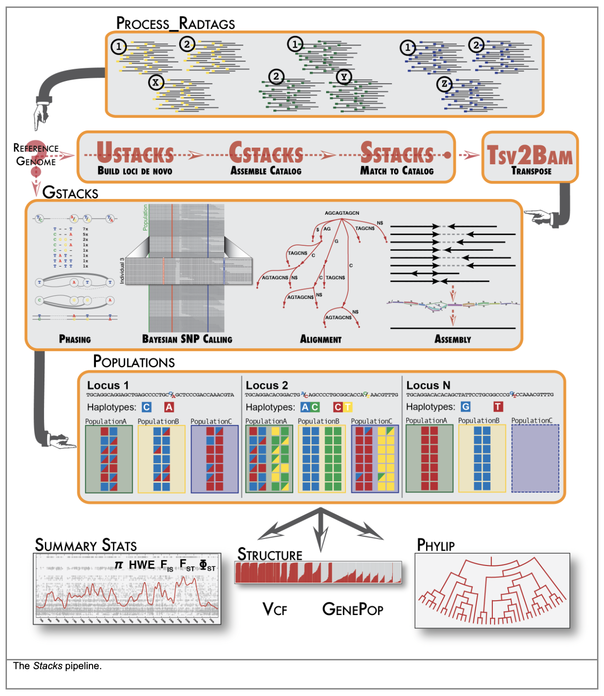

# Preliminary pop-gen analyses
### Last week:
> Last week we ran the Stacks pipeline for denovo assemble, align, and call SNPs from our RAD loci. As a refresher, this process is detailed in the following diagram:


> For our final step, we used the Stacks 'populations' module to output all called SNPs as a completely unfiltered variant call format (VCF) file using the following syntax:
```
## Run populations completely unfiltered and output unfiltered vcf, we will do filtering using the SNPfiltR package
/home/d669d153/work/stacks-2.41/populations -P stacks.prelim -M pipeline_popmap.txt --vcf -t 15
```
This should have resulted in the creation of a file named 'populations.snps.vcf' in the directory named 'stacks.prelim'. If you don't see this file, look through the error messages output by Stacks in your slurm output file, and rerun any steps in the Stacks pipeline that failed, until you see the file 'populations.snps.vcf'.

### This week:
> We will check out the results from our preliminary Stacks run right away. Start by copying your VCF file from the cluster to your local machine, using a command like (you will need to modify paths to match your own directory structures):
```
scp -r d669d153@hpc.crc.ku.edu:/home/d669d153/work/cluster.project.directory/populations.snps.vcf /Users/devder/Desktop/local.project.directory/
```

Now that we have our vcf file copied to our local machine, we can work with it in an interactive Rstudio session. To begin, open Rstudio, and in the header tab select file > new file > Rmarkdown.

In your new Rmarkdown file, add your name as author, and give this analysis an informative title, in my case, 'Preliminary analyses of Philippines Dicaeum RAD data'. Now delete all of the generic recommended text, i.e., lines 8 and below. In it's place, copy the following code:

~~~
### Install and load packages
```{r}
install.packages("vcfR")
library(vcfR)
install.packages("SNPfiltR")
library(SNPfiltR)
install.packages("StAMPP")
library(StAMPP)
install.packages("adegenet")
library(adegenet)
install.packages("ggplot2")
library(ggplot2)
```
~~~

Run this chunk one line at a time, monitoring and debugging any issues with installing and loading these five packages which we will need for preliminary analyis.

Now we are ready to read the vcf into our working environment. Do so by inserting the following code chunk into your Rmarkdown script:

~~~
### Read in vcf using the vcfR package
```{r}
#read vcf
v<-read.vcfR("~/Users/devder/Desktop/local.project.directory/populations.snps.vcf")
```
~~~

### Note: Remember to adjust the path to match your local directory structure. Tab complete is your friend for navigating directory structure and avoiding typos!

Now add a code chunk to your script that generates exploratory visualizations of the missing data proportion in each sample, and allows you to set a customized cutoff to drop additional samples that may have passed initial QC but are still dragging down the dataset:
~~~
### Filter for missing data per sample
```{r}
#investigate proportion missing genotypes in each sample using the SNPfiltR package
missing_by_sample(v)

#investigate the proportion missing genotypes in each SNP using the SNPfiltR package
missing_by_snp(v)

#remove hopeless samples
v<-missing_by_sample(v, cutoff = .83)
```
~~~

Run this chunk one line at a time, taking time to understand each visualization and customize a cutoff that is optimal for your dataset.

Now add a chunk to your script that will visualize the missing data proportion in each SNP, and allow you to set an optimized cutoff:
### Filter for missing data per SNP
```{r}
#investigate the proportion missing genotypes in each SNP using the SNPfiltR package
missing_by_snp(v)

#remove hopeless SNPs
v<-missing_by_snp(v, cutoff = .8)

#remove invariant SNPs generated by removing some individuals from the dataset
v<-min_mac(v, min.mac = 1)
```

Again, run this chunk one line at a time, taking time to understand each visualization and customize a cutoff that is optimal for your dataset.

Now you have a roughly filtered SNP dataset that you can feel safe making evolutionary inferences from. We will do a handful of analyses today to make sure we haven't included any obviously mislabeled or contaminated samples in our dataset.

To start, we will make my favorite type of preliminary data visualization: an unrooted phylogenetic network. To do so, copy the following chunk into your script:
~~~
### Construct an input matrix for SplitsTree
```{r}
#convert to genlight
gen<-vcfR2genlight(v)

#use the function gsub() to rename sample names to something descriptive and <= 10 characters
gen@ind.names
gen@ind.names<-gsub("D_hypoleucum","hy", gen@ind.names)
gen@ind.names<-gsub("D_nigrilore","ni", gen@ind.names)
gen@ind.names

#assign samples to arbitrary populations (a requirement for the function stamppNeisD())
pop(gen)<-gen@ind.names

#create a pairwise distance matrix including all individual samples, as specified by 'pop = FALSE'
sample.div <- stamppNeisD(gen, pop = FALSE)

#export the distance matrix as a text file, that can be read into SplitsTree4
stamppPhylip(distance.mat=sample.div, file="~/Desktop/phil.dicaeum/dic.80.splits.txt")

#view tree
#knitr::include_graphics("/Users/devder/Desktop/phil.dicaeum/splitstree.with.birds.png")
```
~~~

Again, remember to customize this chunk for your dataset, and run it one line at a time to make sure it all works. After you have generated a nice phylogenetic network, you can save it as an image and uncomment the last line to display it within your Rmarkdown script. 

But first, download the SplitsTree4 (current working version) version appropriate for your operating system [here](https://software-ab.informatik.uni-tuebingen.de/download/splitstree4/welcome.html)

Now, open SplitsTree4 and in the header tab select file > open, and then navigate to the .txt output file from the previous chunk. Double click on your text file and an unrooted 'neighbor-net' (type of phylogenetic network) will be automatically generated. Check all of the tips against their species ID's and sampling localities and make sure everything is making sense to you!


### Bonus: making a PCA
Another preliminary analysis that can be helpful is seeing how samples cluster in multi-dimensional genomic space. The easiest way to do this is principal components analysis (PCA). Copy the following chunk into your Rmarkdown script to construct a PCA from your filtered SNP dataset:

~~~
### Make a PCA
```{r}
#make a list of species names to assign as 'population'
pop.vec<-gsub("D_","",colnames(v@gt)[-1])
pop.vec<-gsub("_.*","",pop.vec)

#make input popmap, a dataframe with two columns 'id' and 'pop'
pops<-data.frame(id=colnames(v@gt)[-1],
                 pop=pop.vec)

#construct PCA
assess_missing_data_pca(v, popmap = pops, clustering = FALSE)
```
~~~

As you can see, you must assign samples to sensible populations in order to get much out of a clustering analysis


If you'd like to see the preliminary analyses I did on my dataset, you can view the code and results as a .html report (viewable in any web browser, or hostable on websites, GitHub repositories, etc.) here: xxx
