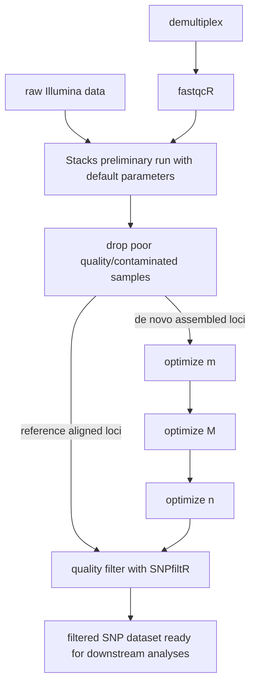

# Determine optimized dataset and filter your SNPs
### Last week:
Last week we ran three [Stacks](https://catchenlab.life.illinois.edu/stacks/) iterations setting the 'n' parameter at M-1,M,M+1. 

### This week:
We will see which value is optimal for our dataset according to the 'R80' cutoff.

#### Navigate to your project directory on the cluster
```
home  
  |_work
      |_project.directory     (*you are here)
              |_fastq
              |_qc
              |_raw.data
              |_stacks.prelim
              |_stacks_m3
              |_stacks_m4
              |_stacks_m5
              |_stacks_m6
              |_stacks_m7
              |_stacks_bigM1
              |_stacks_bigM2
              |_stacks_bigM3
              |_stacks_bigM4
              |_stacks_bigM5
              |_stacks_bigM6
              |_stacks_bigM7
              |_stacks_bigM8
              |_stacks_nX
              |_stacks_nX
              |_stacks_nX
```

Now move each of the vcf files containing your SNP data into the project directory by copying and pasting the following code into your terminal:
```
cp stacks_nX/populations.snps.vcf ./nX.vcf
cp stacks_nX/populations.snps.vcf ./nX.vcf
cp stacks_nX/populations.snps.vcf ./nX.vcf
```
You will need to customize this code to match the 3 values of 'n' that you set, which will depend on what your optimized 'M' value was.

Now copy these vcf files into your project directory on your local machine using a command like the following:
```
scp -r username@hpc.crc.ku.edu:/home/username/work/project.directory/n* /Users/username/Desktop/project.directory/
```

Now we will use commands from the [RADStackshelpR](https://github.com/DevonDeRaad/RADstackshelpR) to determine what the optimal 'n' value is for our dataset. Open your Rmarkdown script from last week, and copy in the following code chunk below your chunks from last week:
~~~
### Optimize 'n'
```{r}
#optimize_bigM function will generate summary stats on your 5 iterative runs
#input can be full path to each file, or just the file name if the vcf files are in your working directory
n.out<-optimize_n(nequalsMminus1="/Users/username/Desktop/philippines.rad/nX.vcf",
           nequalsM="/Users/username/Desktop/philippines.rad/nX.vcf",
           nequalsMplus1="/Users/username/Desktop/philippines.rad/nX.vcf")
           
#use this function to visualize the effect of varying 'n' on the number of SNPs retained
vis_snps(output = n.out, stacks_param = "n")

#visualize the effect of varying 'n' on the number of polymorphic loci retained
vis_loci(output = n.out, stacks_param = "n")
```
~~~

You will need to customize the full path specifying where on your local machine your output vcf files from Stacks reside, and the vcf filenames themselves.

You should end up with an image like this:


The red asterisk here lets you know that the optimal 'n' value for this dataset is equal to M+1.

If you've made it this far, congratulations, you now have a fully optimized de novo assembled SNP dataset using [Stacks](https://catchenlab.life.illinois.edu/stacks/) and [RADstackshelpR](https://github.com/DevonDeRaad/RADstackshelpR).

Now we will filter our SNP dataset for quality. I have written the R package [SNPfiltR](https://github.com/DevonDeRaad/SNPfiltR) for exactly this purpose. The package is designed to implement all of the necessary quality filters for next-gen SNP data directly in R, with interactive visualizations that allow you to optimize filtering cutoffs for your specific dataset. I strongly encourage checking out the [website](https://devonderaad.github.io/SNPfiltR/) associated with the package if you have questions about how to use any of the functions. I also recommend reading [These aren't the loci you're looking for](https://onlinelibrary.wiley.com/doi/full/10.1111/mec.14792) and Jon Puritz's excellent [SNP filtering tutorial](http://www.ddocent.com/filtering/) to better understand why and how to filter SNP data.

Today, we will basically just follow the RADseq SNP filtering vignette from the SNPfiltR package, found [here](https://devonderaad.github.io/SNPfiltR/articles/scrub-jay-RADseq-vignette.html). The steps in the tutorial should be somewhat familiar to you because we used some of these commands a few weeks ago when we investigated our preliminary dataset. I suggest following all of the filtering steps outlined in the vignette, but do be aware that optimal parameter settings and filter implementations will always be dataset specific. The most important thing is getting a set of SNPs that you trust, that you can defend to reviewers. Beyond that, if reviewers/readers can follow your filtering process (which they should be able to if you follow the tutorial, comment your code, and knit to an .html) then you are doing reproducible science, and people in the future (including yourself) can come back to your work and try to verify your results, or test the effects of varying your filtering parameters to see how robust your results are (this is a good thing).

I recommend opening a new Rmarkdown file, and copying in the code chunks from the vignette one chunk at a time, each time customizing the syntax to work with your dataset, and testing different thresholds using the interactive visualizations. Don't forget to write your filtered vcf file to your disk at the end of the script, so that you have your filtered SNP dataset saved for downstream analyses!


